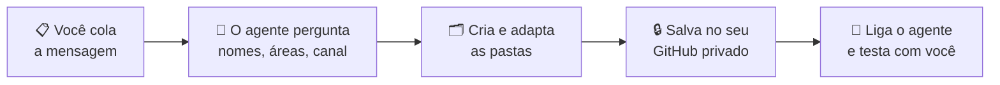
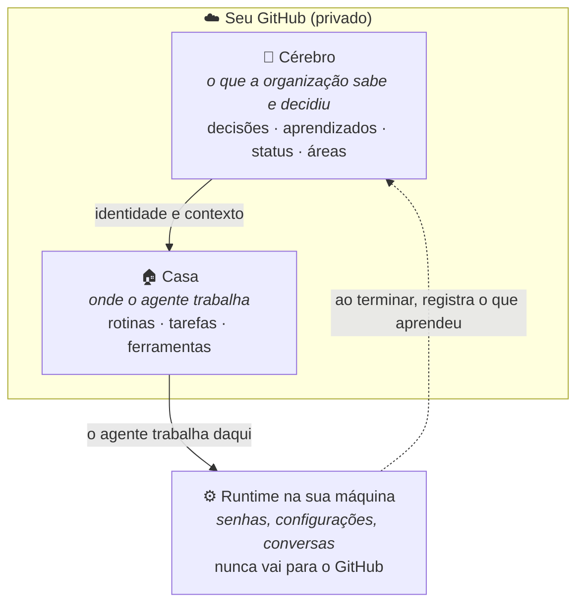
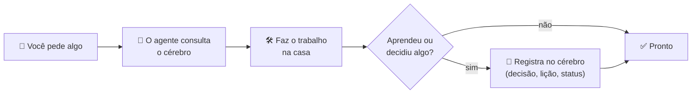
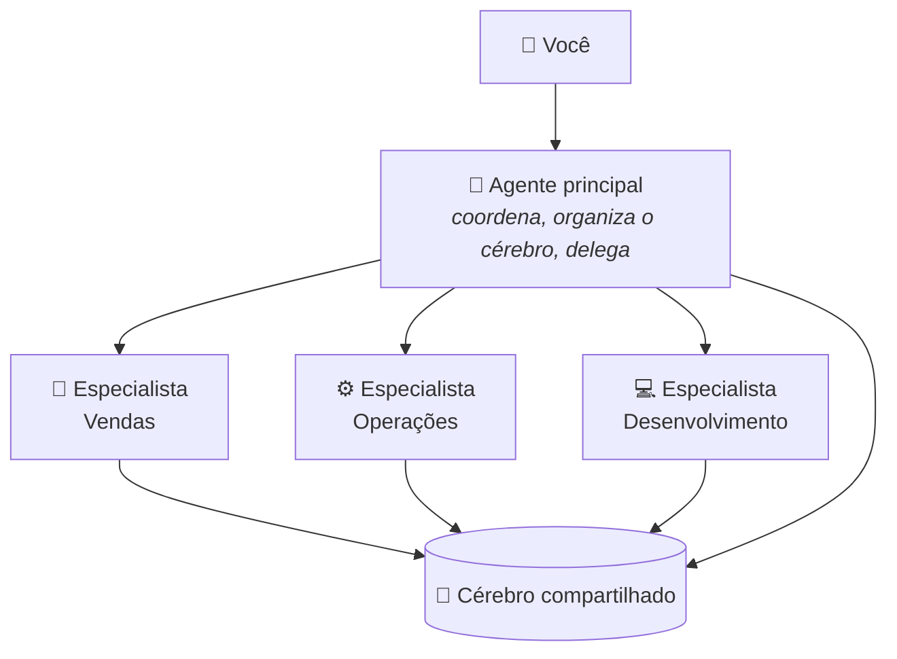

# 🧠 hermes-agent-template

**Dê ao seu agente de IA uma memória organizada, que cresce com você e fica guardada no seu GitHub.**

Este template monta, em uma conversa, a mesma estrutura que usamos para operar uma frota de agentes [Hermes](https://github.com/NousResearch/hermes-agent):
um **cérebro** com tudo que sua organização sabe e decide, um **agente principal** que cuida dele e,
quando fizer sentido, **agentes especialistas** para cada área.

Você escolhe todos os nomes. Nenhum dado nosso vem junto: só a organização.

---

## ✨ Comece em 1 minuto

Copie a mensagem abaixo e **cole no seu agente** (Hermes, Claude, ChatGPT com terminal, Codex...):

```text
Quero montar a estrutura do https://github.com/DizevolvTech/hermes-agent-template
para a minha organização. Leia o AGENTS.md do repositório e me conduza passo a passo:
faça as perguntas, crie as pastas, adapte tudo à minha realidade e versione no meu GitHub.
```

O agente vai conversar com você e fazer o resto:



> Prefere fazer sozinho? `git clone` deste repositório e rode `./setup.sh`; ele faz as mesmas perguntas.

---

## 🏠 Como funciona

Pense numa empresa: existe a **memória** (o que já foi decidido e aprendido), o **escritório** onde o trabalho acontece
e o **computador** ligado na tomada. Aqui é igual:



| | O que guarda | Exemplo |
|---|---|---|
| 🧠 **Cérebro** | Memória da organização | "Decidimos atender só por WhatsApp", "o preço mudou em março" |
| 🏠 **Casa** | Como o agente executa | Rotina diária de resumo, pedidos para outros agentes, relatórios |
| ⚙️ **Runtime** | Estado vivo e segredos | Token do Telegram, histórico das conversas |

### O ciclo do dia a dia



Cada registro vira um commit: tem data, autor e motivo. Daqui a um ano, você (ou um agente novo) sabe **por que** as coisas são como são.

---

## 💡 Por que assim

- **🧠 A memória é da organização, não do agente.** Troque de modelo, de máquina ou de agente: o que foi aprendido continua lá.
- **🔍 Tudo auditável.** Cada decisão tem histórico no GitHub. Dá para ver o que mudou, quando e reverter.
- **🧭 Nunca vira bagunça.** Cada pasta tem um mapa (`MAPA.md`), e o próprio Git bloqueia pasta nova fora do mapa.
  O agente acha o que precisa sem ler tudo, o que deixa as respostas melhores e mais baratas.
- **🔒 Segredos protegidos.** Senhas e tokens ficam só na sua máquina, e o Git bloqueia se alguém tentar salvar um.
- **🎛️ Autonomia com limites.** Você define o que o agente pode fazer sozinho e o que precisa da sua aprovação.
- **🌱 Cresce por área.** Começa com um agente só; quando uma área pedir, ganha um especialista sem bagunçar o resto.
- **💻 Uma máquina basta.** Tudo pode rodar numa única VPS ou computador.

---

## 🌱 Crescendo: agentes especialistas por área

Comece **só com o agente principal**. Quando uma área tiver muita demanda, peça ao seu agente:
*"crie um agente especialista para vendas chamado ___"*. Ele usa o `novo-agente.sh` e organiza tudo.



- Cada especialista tem **sua casa, sua configuração e seu canal**, e todos compartilham o mesmo cérebro.
- O agente principal é o **coordenador**: distribui pedidos, mantém tudo organizado e audita.
- Um especialista cuida da **sua área** e devolve para o principal o que for de outra.
- Os nomes são seus: "Mercúrio", "Ana do Comercial", "Bot de Vendas"...

---

## 📦 O que vem pronto

| | |
|---|---|
| 🧠 **Cérebro** | Mapa de navegação, áreas da empresa, registro de decisões, aprendizados e status, identidade do agente, regras de convivência entre agentes |
| 🧭 **Agente principal** | Personalidade, mandato, quem aprova o quê, formato de pedido de aprovação, registro de rotinas automáticas |
| 🏠 **Casa** | Rotinas, pedidos entre agentes, relatórios, mensagens aguardando aprovação |
| 🛡️ **Proteções** | Bloqueio de senha no Git, mapa sempre atualizado, aviso se alguém editar a identidade fora do lugar |
| 🧰 **Ajudantes** | Criar estrutura, criar especialista, checar o que falta preencher, status do agente |

Detalhes técnicos de cada pasta e script: [`docs/referencia.md`](docs/referencia.md).

---

## 📚 Para ir mais fundo

| Documento | Para quê |
|---|---|
| [`AGENTS.md`](AGENTS.md) | O roteiro que o seu agente segue para montar tudo com você |
| [`docs/arquitetura.md`](docs/arquitetura.md) | Os princípios por trás da estrutura |
| [`docs/runtime.md`](docs/runtime.md) | Como o Hermes fica organizado na máquina (`~/.hermes`, perfis) |
| [`docs/infraestrutura.md`](docs/infraestrutura.md) | Uma ou várias máquinas, serviço, sincronização |
| [`docs/referencia.md`](docs/referencia.md) | Todas as pastas, scripts e comandos |
| [`docs/sanitizacao.md`](docs/sanitizacao.md) | Para quem mantém um fork público |

---

<sub>Licença MIT · Contribuições: `tools/check-template.sh` precisa passar (roda no CI).</sub>
